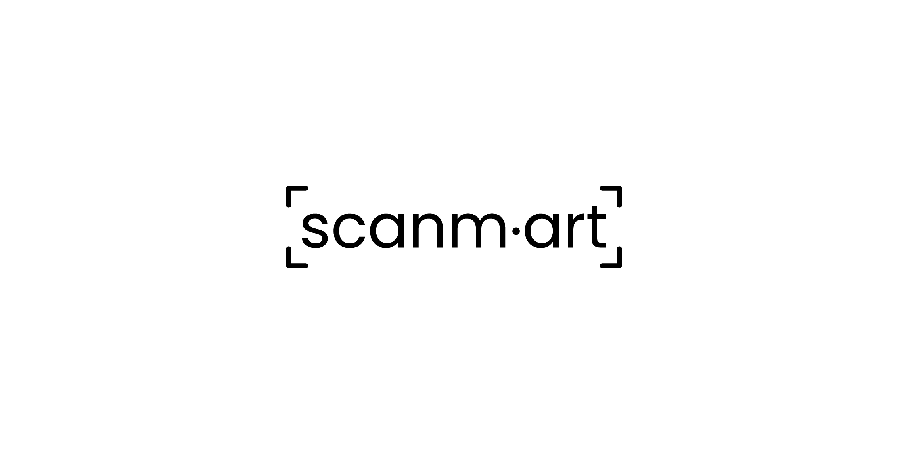
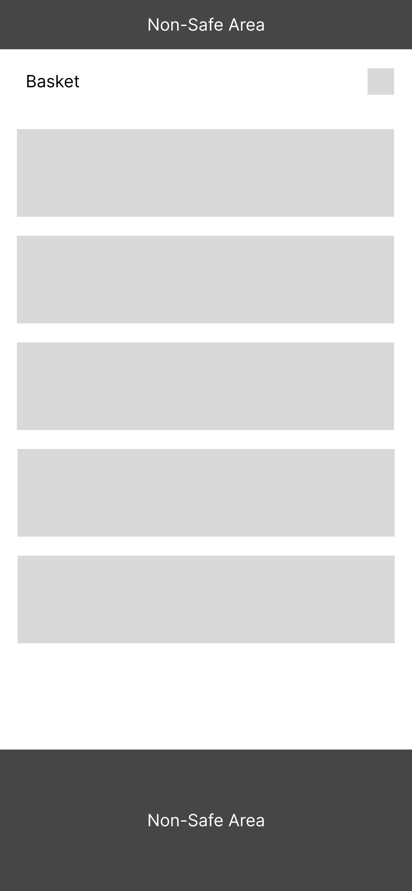

# Scanmart App
Scanmart App is a web app used for a self-checkout workflow, where customers can scan the products themselves and add them to their basket.

The app was constructed with the help of create-react-app and supplemented with the following libraries/tools/packages:
1. Storybook (presenting isolated component)
2. Bootstrap (used for general styling & responsiveness)
3. Quagga JS (used for scanning items)
4. Firebase Realtime Database (used for storing basket data)
5. prettier (used for code formatting)
6. PropTypes (used for type-checking)
7. toastify (used to presenting toasts through the app)
8. uuid (used for generating unique IDs for baskets)
9. react-router (used for routing)

The code is stored in a GitHub repository, and the app is deployed on Netlify.
Netlify start the build & deployment process everytime there is a change, i.e. a merged PR on the ``main`` branch.
Firebase config (app ID, app URL, etc.) is stored as environment variables.

To run the app locally, please scroll down and follow the instructions provided by CRA.
In order to get the camera to work locally, add an .env file in the project's root and insert this value in it ``HTTPS=true``. Rebuild the app and it should work. 

### Task list in chronological order
1. Research existing solutions 
2. Find the appropriate & available name
3. Buy the domain 
4. Create a logo
5. Create wireframes
6. Start a local project & create a GitHub repo 
7. Start a project in Netlify & connect the domain
8. Connect the GitHub repo with the Netlify project & start automatic build & deploy process
9. Install Storybook
10. Install Bootstrap & add initial styling 
11. Install & implement Quagga library
12. Atomize the code into components
13. Install & implement prettier
14. Set up React Context for the basket data & components 
15. Install & implement react router
16. Install & implement Firebase Realtime Database for saving the basket data
17. Set up creation of anonymous basket sessions
18. Add additional code comments
19. Add and adapt a few Storybook stories
20. Update the documentation

### Research & naming
Materials used for functionality & UI research:
1. [ScanPayGo](https://leroy-merlin-scanpaygo.en.softonic.com/android/)
2. [MishiPay](https://mishipay.com/the-mishipay-app/)
3. [AckerPay](https://ackerpay.com/)
4. [RetailCloud Self Checkout App](https://retailcloud.com/products/self-checkout.html)
5. [mInventory app](https://apps.apple.com/in/app/minventory-app/id1452825986)
6. [retail7.io Self Checkout App](https://retail7.io/de/de/self-checkout)
7. [BILLA Scan & Go](https://www.billa.at/unsere-maerkte/services-in-den-maerkten/scan-go)
8. [Scan&Go](https://scanandgo.com/)
9. [Dribbble Post](https://dribbble.com/shots/23380715-Self-checkout-Store-Mobile-App)
10. [barcoo App](https://apps.apple.com/at/app/barcoo-qr-barcode-scanner/id339525465)

Finally, the barcoo app served as the biggest inspiration for the UI and UX.
I basically reviewed the design of each of the above-mentioned apps (where it was available) and tried to find the most suitable parts for my app.
Once I was satisfied with the UI/UX research, I tried to come up with a name. The trick was to find something that makes sense, but that has not been previously used, i.e. has an available domain.
I settled on *Scanmart* which is a product of two words "scan" and "market" and I bought the "*scanm.art*" domain to ensure its uniqueness.

This project is available at [scanm.art](https://scanm.art/).

### Logo & Wireframes
#### Logo
I didn't want to lose a lot of time on the logo, so I went with a mostly typographical one.
There are corner borders added to it, to simulate a barcode scanner design. The font used is [Poppins](https://fonts.google.com/specimen/Poppins?preview.text=scanm.art&stroke=Sans+Serif).
I used a Google font, because they are free and their license allows commercial use.

|  |  |
|--------------------------------------------------------------------------------|---------------------------------------------------------------------------------|
| *Main Logo*                                                                    | *Favicon*                                                                       |


#### Wireframes

|  |  |  |  |  |
|------------------------------------------------------------------|-----------------------------------------------------------------------------|-------------------------------------------------------------------------------|---------------------------------------------------------------------------|--------------------------------------------------------------------|
| *Start*                                                          | *Main Screen*                                                               | *Camera Error*                                                                | *Scan Modal*                                                              | *Basket*                                                           |


### Technical project description
#### File & Folder Structure

``src`` folder is where everything resides.

``assets`` folder contains images/icons used in the project, as well as the custom styles & the graphics used in the README file.

``components`` folder, as its names states, contains the components used in this project. They are each stored in separate folders.

``context`` folder contains the Basket & Offcanvas context which serve to provide information about the sidebar and the scanned items throughout the app.

``utils`` folder contains one utility function.

``views`` folder contains the views used in this app.

The whole app is structured in a way, where context providers wrap the routes and the routes contain one layout which further presents the views, i.e. its sub-routes.

```
.
|-- README.md
|-- netlify.toml
|-- package-lock.json
|-- package.json
|-- public
|   |-- index.html
|   |-- manifest.json
|   |-- miniLogo.png
|   `-- robots.txt
`-- src
    |-- App.css
    |-- App.js
    |-- App.test.js
    |-- assets
    |   |-- docs
    |   |   |-- Basket.png
    |   |   |-- CameraError.png
    |   |   |-- MainScreen.png
    |   |   |-- ScanModal.png
    |   |   |-- Start.png
    |   |   |-- faviconPresentation.png
    |   |   |-- logo.ai
    |   |   `-- logoPresentation.png
    |   |-- img
    |   |   |-- bag.svg
    |   |   |-- barcode.svg
    |   |   |-- box.svg
    |   |   `-- logo.png
    |   `-- scss
    |       |-- custom.css
    |       |-- custom.css.map
    |       `-- custom.scss
    |-- components
    |   |-- BarcodeScanner
    |   |   `-- BarcodeScanner.js
    |   |-- CartItem
    |   |   |-- CartItem.js
    |   |   `-- CartItem.stories.js
    |   |-- Controls
    |   |   |-- Controls.js
    |   |   `-- Controls.stories.js
    |   |-- Header
    |   |   `-- Header.js
    |   |-- ItemModal
    |   |   `-- ItemModal.js
    |   |-- Offcanvas
    |   |   `-- OffcanvasComponent.js
    |   `-- VideoComponent
    |       `-- VideoComponent.js
    |-- context
    |   |-- BasketContext.js
    |   `-- OffcanvasContext.js
    |-- firebase.js
    |-- index.js
    |-- logo.svg
    |-- reportWebVitals.js
    |-- setupTests.js
    |-- stories
    |   |-- Configure.mdx
    |   `-- assets
    |       |-- accessibility.png
    |       |-- accessibility.svg
    |       |-- addon-library.png
    |       |-- assets.png
    |       |-- avif-test-image.avif
    |       |-- context.png
    |       |-- discord.svg
    |       |-- docs.png
    |       |-- figma-plugin.png
    |       |-- github.svg
    |       |-- share.png
    |       |-- styling.png
    |       |-- testing.png
    |       |-- theming.png
    |       |-- tutorials.svg
    |       `-- youtube.svg
    |-- utils
    |   `-- removeVideoElement.js
    `-- views
        |-- Main
        |   `-- Main.js
        `-- Start
            `-- Start.js

```

# Getting Started with Create React App

This project was bootstrapped with [Create React App](https://github.com/facebook/create-react-app).

## Available Scripts

In the project directory, you can run:

### `npm start`

Runs the app in the development mode.\
Open [http://localhost:3000](http://localhost:3000) to view it in your browser.

The page will reload when you make changes.\
You may also see any lint errors in the console.

### `npm test`

Launches the test runner in the interactive watch mode.\
See the section about [running tests](https://facebook.github.io/create-react-app/docs/running-tests) for more information.

### `npm run build`

Builds the app for production to the `build` folder.\
It correctly bundles React in production mode and optimizes the build for the best performance.

The build is minified and the filenames include the hashes.\
Your app is ready to be deployed!

See the section about [deployment](https://facebook.github.io/create-react-app/docs/deployment) for more information.

### `npm run eject`

**Note: this is a one-way operation. Once you `eject`, you can't go back!**

If you aren't satisfied with the build tool and configuration choices, you can `eject` at any time. This command will remove the single build dependency from your project.

Instead, it will copy all the configuration files and the transitive dependencies (webpack, Babel, ESLint, etc) right into your project so you have full control over them. All of the commands except `eject` will still work, but they will point to the copied scripts so you can tweak them. At this point you're on your own.

You don't have to ever use `eject`. The curated feature set is suitable for small and middle deployments, and you shouldn't feel obligated to use this feature. However we understand that this tool wouldn't be useful if you couldn't customize it when you are ready for it.

## Learn More

You can learn more in the [Create React App documentation](https://facebook.github.io/create-react-app/docs/getting-started).

To learn React, check out the [React documentation](https://reactjs.org/).

### Code Splitting

This section has moved here: [https://facebook.github.io/create-react-app/docs/code-splitting](https://facebook.github.io/create-react-app/docs/code-splitting)

### Analyzing the Bundle Size

This section has moved here: [https://facebook.github.io/create-react-app/docs/analyzing-the-bundle-size](https://facebook.github.io/create-react-app/docs/analyzing-the-bundle-size)

### Making a Progressive Web App

This section has moved here: [https://facebook.github.io/create-react-app/docs/making-a-progressive-web-app](https://facebook.github.io/create-react-app/docs/making-a-progressive-web-app)

### Advanced Configuration

This section has moved here: [https://facebook.github.io/create-react-app/docs/advanced-configuration](https://facebook.github.io/create-react-app/docs/advanced-configuration)

### Deployment

This section has moved here: [https://facebook.github.io/create-react-app/docs/deployment](https://facebook.github.io/create-react-app/docs/deployment)

### `npm run build` fails to minify

This section has moved here: [https://facebook.github.io/create-react-app/docs/troubleshooting#npm-run-build-fails-to-minify](https://facebook.github.io/create-react-app/docs/troubleshooting#npm-run-build-fails-to-minify)
